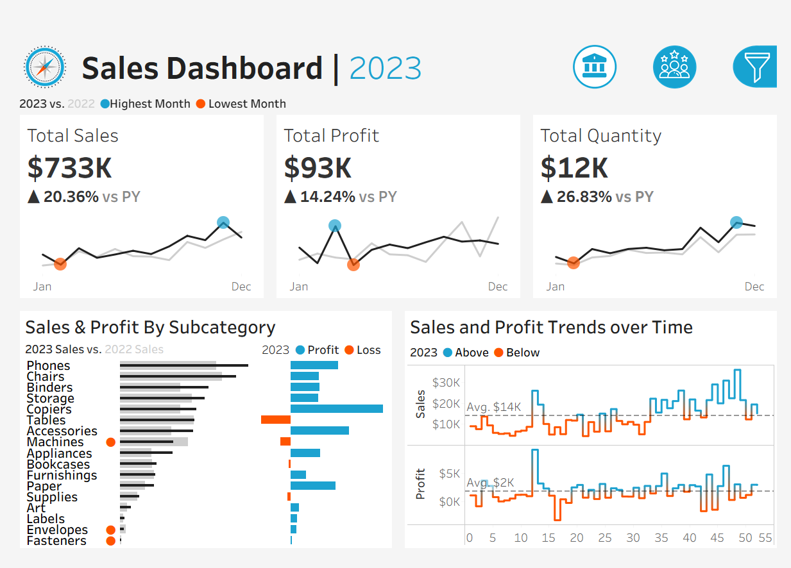
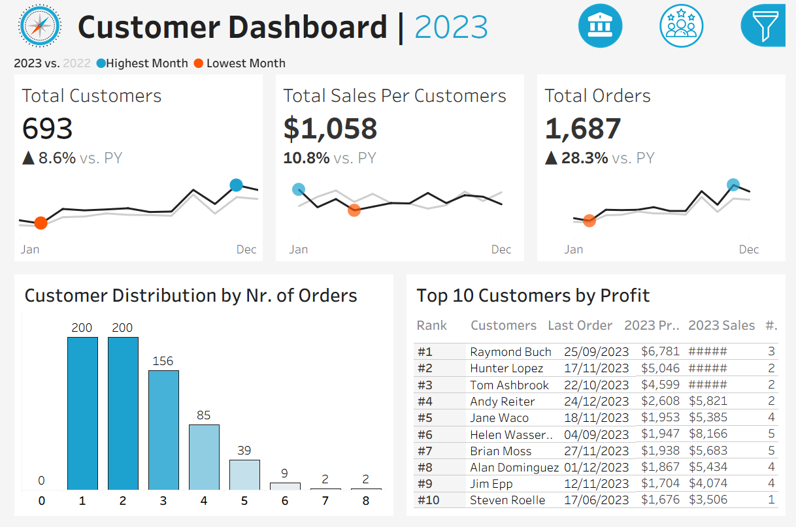
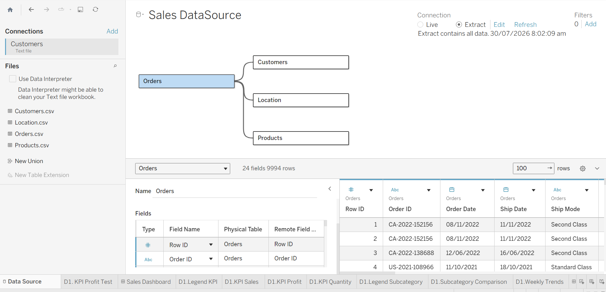

# 📊 Sales & Customer Intelligence Dashboard | Tableau

A two-dashboard Tableau solution that turns four years of raw retail transactions into an executive-ready view of **year-over-year sales performance** and **customer behavior** — built to let sales leaders and marketing teams answer "how are we doing, and who are our best customers?" in seconds, not spreadsheets.

---

## 🎯 Business Problem & Objectives

Sales managers and executives need to track performance over time, but raw transactional data doesn't answer the questions that actually drive decisions:

- Are we ahead of or behind last year — in sales, profit, and volume?
- Which months and weeks over- or under-performed, and by how much?
- Which product subcategories are winning, and which are dragging on profit?
- Who are our customers, how often do they buy, and who are the ones worth protecting?

Digging through raw rows in a spreadsheet to answer these questions doesn't scale, and it doesn't give leadership a consistent, repeatable way to check in on the business.

**Primary goal:** build two interactive, connected Tableau dashboards — a **Sales Performance Dashboard** and a **Customer Insights Dashboard** — that let non-technical stakeholders self-serve these answers, compare any year against the one before it, and drill into the data without writing a single query.

---

## 🖥️ Interactive Dashboards Preview




---

## 📈 Key Metrics & Business Insights Tracked

### Sales Performance Dashboard
| Metric | What it tells the business |
|---|---|
| **Total Sales, Profit & Quantity** (CY vs. PY) | Instant read on whether the current selected year is trending up or down against the prior year for each KPI.|
| **Monthly Sales Trend** | Line/sparkline trend per KPI with the best and worst months automatically flagged |
| **Sales & Profit by Sub-Category** | Side-by-side comparison to spot which product lines drive revenue vs. which drive profit |
| **Weekly Sales & Profit vs. Average:** | Every week benchmarked against the overall weekly average, with over/under performance color-coded above and below the baseline. |

### Customer Insights Dashboard
| Metric | What it tells the business |
|---|---|
| **Total Customers, Sales per Customer & Orders** (CY vs. PY) | Tracks whether the customer base is growing and whether each customer is worth more when comparing current selected year with prior year |
| **Monthly Customer Trend** | Same logic as sales dashboard. Line/sparkline trend per KPI with the best and worst months automatically flagged |
| **Customer Order-Frequency Distribution** | A histogram of how many customers placed 1 order, 2 orders, 3 orders, etc. — a quick read on loyalty and repeat-purchase behavior |
| **Top 10 Customers by Profit** | Rank, number of orders, current sales, current profit, and last order date for the accounts that matter most |

---

## 🛠️ Technical Stack & Advanced Implementations

Built entirely in **Tableau Desktop (2026.1)**, using native Tableau calculation and interactivity features rather than any external ETL — everything below lives inside the workbook itself.

- **Year-over-Year Logic via Conditional Calculations** — Every KPI (Sales, Profit, Quantity, Customers, Orders) has a matching pair of calculated fields that isolate the "current year" and "previous year" slice of the data, e.g.:
  ```
  CY Sales:  IF YEAR([Order Date]) = [Select Year] THEN [Sales] END
  PY Sales:  IF YEAR([Order Date]) = [Select Year] - 1 THEN [Sales] END
  ```
  These feed a set of % Difference calculations (CY - PY) / PY) using (with divide-by-zero protection) to safely calculate the year-over-year percentage change for every KPI card and comparison badge on both dashboards.

- **Dynamic Year Selection (Parameter Control)** — A single **"Select Year"** parameter (2020–2023) sits on both dashboards and drives every CY/PY calculation at once. Change the parameter, and both dashboards instantly re-baseline to a new "current" year — no filters to re-apply, no charts to rebuild.

- **FIXED Level of Detail (LOD) for Customer Behavior** — The customer order-frequency histogram is powered by a FIXED LOD expression:
  ```
  Nr. of Orders Per Customer: { FIXED [CY Customer] : COUNTD([CY Order ID]) }
  ```
  This locks the "orders per customer" count at the customer level regardless of what else is on the view, so the distribution stays accurate even as users filter by category, region, or year.

- **Table-Calculation Ranking for the Top Customers List** — Rather than a static rank column, the Top 10 Customers table uses an `INDEX()` table calculation (sorted by profit in descending) to generate each customer's rank live. Because it's a table calculation rather than a stored field, the ranking recalculates instantly whenever a filter, parameter, or click-to-filter action changes the underlying view — with no extra data processing overhead.

- **Automated Peak/Trough & Above/Below-Average Highlighting** — `WINDOW_MAX()`-based calculations automatically flag the highest and lowest months on each KPI trend line, and `WINDOW_AVG()`-based calculations classify each week as "above" or "below" its own average — so the eye is drawn straight to the outliers instead of the analyst having to hunt for them.

- **Dynamic Reference Lines** — Native Tableau average reference lines are layered on the weekly Sales and Profit charts, paired with the above/below-average calculation, so every week is visually evaluated against the overall weekly average the moment the view loads.

- **Guided Interactivity & Cross-Filter Actions** — Four dashboard filter actions turn the charts themselves into filters: clicking a bar in the Sub-Category Comparison or Weekly Trends charts cross-filters the entire Sales Dashboard, and clicking a bar in the Customer Distribution histogram or a row in the Top Customers table cross-filters the entire Customer Dashboard — letting users explore by clicking, not by hunting through drop-downs.

- **Icon-Driven Navigation & Collapsible Filter Panel** — Dedicated navigation buttons (a sales/finance icon and a customer icon, featuring active toggle states) allow seamless switching between the Sales and Customer view, while a funnel button toggles a collapsible side panel for quick filters—keeping the main canvas clutter-free. 

- **Global Quick Filters** — Category, Sub-Category, Region, State, and City filters sit in that collapsible panel and apply across every chart on the active dashboard simultaneously.

---

## 🗄️ Data Architecture & Schema

The data model follows a classic **retail sales star-schema**, built using Tableau’s Logical Layer Relationships (rather than physical joins) to preserve each table's native level of detail and prevent data duplication or fan-out:

```
                     ┌───────────────────┐
                     │   Customers.csv    │
                     │  (793 customers)   │
                     └─────────┬─────────┘
                               │ Customer ID
                     ┌─────────▼─────────┐
   Location.csv      │      Orders       │      Products.csv
 (632 postal codes,  │  (9,994 line items │   (1,894 products,
  49 states, 4       │◄─  across 5,009   ─►│    3 categories,
  regions)            │   orders, 2020–23) │    17 sub-categories)
       ▲              └────────────────────┘         ▲
       │ Postal Code                      Product ID │
       └──────────────────────────────────────────────┘
```

- **Orders.csv** — the central fact table: one row per order line item, with Order Date, Sales, Quantity, Discount, and Profit.
- **Customers.csv** — one row per customer, joined on **Customer ID**.
- **Products.csv** — one row per product, joined on **Product ID**, carrying Category and Sub-Category.
- **Location.csv** — one row per postal code, joined on **Postal Code**, carrying City, State, Region, and Country.
- A separate lightweight **Parameters** data source holds the single "Select Year" parameter used across both dashboards.

*(Data spans four full fiscal years — 2020 through 2023 — across the United States.)*



---

## 🚀 How to Access & Explore

- 🔗 [View Live Dashboard on Tableau Public](your-link-here)
- 📥 [Download Tableau Workbook (.twbx)](sales_and_customer_dashboard.twbx)

**Getting the most out of it:**
1. **Pick an year** — Click the funnel icon to expand the filter panel and select a reporting year from the "Select Year" dropdown; every KPI card and trend chart automatically re-baselines against the prior year.
2. **Switch dashboards** — use the icon buttons in the top-right corner to move between the Sales Performance and Customer Insights views.
3. **Open the filter panel** — click the funnel icon to reveal Category, Sub-Category, Region, State, and City filters, and click it again (or the close icon) to tuck the panel away.
4. **Click to filter** — click directly on a bar in the Sub-Category or Weekly Trends charts (Sales Dashboard), or on the histogram / a customer row (Customer Dashboard), to cross-filter the rest of that dashboard. Click the same mark again to clear it.
5. **Read the highlights** — look for the automatically bolded peak/trough months and the color-coded above/below-average weeks — no need to eyeball the raw trend lines yourself.

---

## 🤝 Acknowledgments

This project's business requirements, user story, and dataset are based on the **"Tableau Complete Project End-to-End"** by **Baraa Khatib Salkini ("Data With Baraa")**. All credit for the original project brief, mockups, and teaching goes to him — this repository reflects my own build and implementation of that brief.

📺 Course reference: [https://youtu.be/dahrmqT5GD4](https://youtu.be/dahrmqT5GD4?si=Ehc9mpdnKSJ-BCLl)
